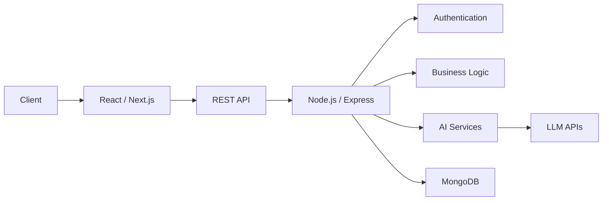

<p align="center">
  <a href="https://akhilkumar.dev">
    
  </a>
  <a href="https://linkedin.com/in/akhilkumar4464">
    
  </a>
  <a href="mailto:akhilsharma774230@gmail.com">
    
  </a>
  <a href="https://github.com/akhilkumar4464">
    
  </a>
</p>

<p align="center">
  
</p>

---

## 👨‍💻 About Me

```ts
const akhil = {
  name: "Akhil Kumar",
  role: "Frontend / Full-Stack Developer",
  education: "B.Tech CSE @ Raffles University",
  graduation: 2028,

  primaryStack: [
    "JavaScript",
    "TypeScript",
    "React",
    "Next.js",
    "Node.js",
    "Express",
    "MongoDB"
  ],

  interests: [
    "AI-powered applications",
    "Generative AI",
    "LLMs",
    "Agentic AI",
    "System Design"
  ],

  currentlyLearning: [
    "Advanced React & Next.js",
    "Backend Architecture",
    "LLM Applications",
    "AI Agents"
  ],

  goal: "Build reliable products that solve real problems."
};
```

> **Frontend-focused developer building full-stack applications with React, Next.js, Node.js and AI integrations.**

I enjoy turning ideas into production-ready applications — from designing responsive interfaces and APIs to authentication, databases, deployment, and AI-powered workflows.

---

## ⚡ What I Build

```text
Frontend
├── Responsive UI
├── Component Architecture
├── State Management
├── API Integration
└── Performance Optimization

Backend
├── REST APIs
├── Authentication & Authorization
├── JWT / Cookies
├── MongoDB Data Modeling
└── Error Handling & Validation

AI Applications
├── LLM Integrations
├── AI-powered Analytics
├── Resume Intelligence
├── Document Processing
└── AI-assisted Workflows

Engineering
├── Git & GitHub
├── API Testing
├── Deployment
├── Environment Configuration
└── Performance Monitoring
```

---

## 🧰 Tech Stack

### Languages

<p>
  
</p>

### Frontend

<p>
  
</p>

### Backend & Database

<p>
  
</p>

### Tools & Platforms

<p>
  
</p>

### AI / APIs

```text
OpenAI APIs
Google Gemini
REST APIs
Axios
LLM-powered workflows
AI data analysis
Prompt engineering
```

---

# 🚀 Featured Projects

## 📊 DataVision-AI

**AI-powered data analysis and visualization platform**

[Live Demo](https://data-vision-ai-zeta.vercel.app/) · [GitHub](https://github.com/Akhilkumar4464)

```text
TypeScript • React • Node.js • MongoDB • OpenAI • Chart.js
```

### Highlights

* 📁 Process Excel, CSV, PDF and Word files
* 🤖 AI-assisted data analysis and insights
* 📈 Automated chart generation
* 📊 Multiple visualization types
* 🧾 Report generation and export
* 🔐 Authentication and protected workflows
* ⚡ Optimized API communication

### Architecture

```text
User
 │
 ▼
React / Next.js UI
 │
 ├── File Upload
 ├── Data Visualization
 └── AI Insights
 │
 ▼
Node.js / Express API
 │
 ├── Authentication
 ├── File Processing
 ├── AI Services
 └── Data Processing
 │
 ├───────────────┐
 ▼               ▼
MongoDB       OpenAI API
```

---

## 🎯 GetYourDestination

**AI-powered resume analysis and interview preparation platform**

[Live Demo](https://get-your-destination-8qb3.vercel.app/)

```text
React • Node.js • Gemini AI • REST API • PDF Processing
```

### Highlights

* 📄 Resume analysis
* 🤖 AI-generated feedback
* 🎯 Interview preparation workflows
* 🧠 AI-powered recommendations
* 📤 PDF / HTML export
* ⚡ Optimized API payloads
* 🔐 Secure authenticated workflows

---

## 💼 Daily Hunt-AI

**Full-stack freelance marketplace**

[Live Demo](https://daily-hunt-2ftg.vercel.app/)

```text
Next.js • React • Node.js • MongoDB • JWT
```

### Highlights

* 👤 Role-based user workflows
* 🔐 JWT authentication
* 💼 Freelancer marketplace functionality
* 💰 Bid management
* 📊 Dynamic dashboards
* 📱 Responsive UI
* ⚡ Performance-focused frontend

---

# 🏗️ Engineering Principles

I try to build applications around a few simple principles:

```text
01. Keep components reusable
02. Keep APIs predictable
03. Validate data at boundaries
04. Separate frontend and backend responsibilities
05. Handle loading / error / empty states
06. Protect authenticated resources
07. Optimize only where it matters
08. Write code that another developer can understand
09. Build for maintainability, not just functionality
10. Ship → measure → improve
```

---

# 🔐 Full-Stack Capabilities



---

# 📚 Currently Learning

```diff
+ Advanced React Patterns
+ Next.js Architecture
+ Backend System Design
+ TypeScript
+ AI Engineering
+ LLM Applications
+ RAG Systems
+ Agentic AI
+ Scalable API Design
```

---

# 📈 GitHub Statistics

<p align="center">
  
  
</p>

<p align="center">
  
</p>

---

# 📊 Contribution Graph

<p align="center">
  
</p>

---

# 🧩 Problem Solving

I regularly work on:

```text
Data Structures & Algorithms
├── Arrays
├── Strings
├── Linked Lists
├── Stacks & Queues
├── Trees
├── Recursion
├── Searching & Sorting
└── Problem Solving Patterns
```

---

# 🎯 2026–2027 Roadmap

```text
Frontend Engineering
████████████████████░░  Advanced React / Next.js

Backend Engineering
██████████████░░░░░░░░  APIs / Architecture

DSA
████████████░░░░░░░░░░  Problem Solving

AI Engineering
██████████░░░░░░░░░░░░  LLMs / RAG / Agents

System Design
███████░░░░░░░░░░░░░░░  Fundamentals → Advanced
```

---

# 🤝 Let's Connect

I'm interested in:

* 🚀 Full-stack development
* 🤖 AI-powered products
* 💡 Open-source projects
* 🧑‍💻 Developer communities
* 💼 Internship & development opportunities
* 🤝 Collaboration on interesting products

<p align="center">
  <a href="https://akhilkumar.dev">
    
  </a>
  <a href="https://linkedin.com/in/akhilkumar4464">
    
  </a>
  <a href="mailto:akhilsharma774230@gmail.com">
    
  </a>
</p>

---

<p align="center">
  <i>Building. Learning. Shipping. Improving.</i>
</p>

<p align="center">
  
</p>


